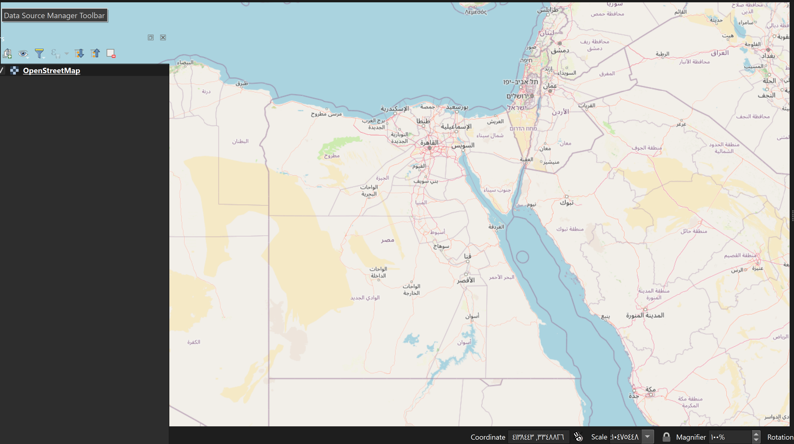
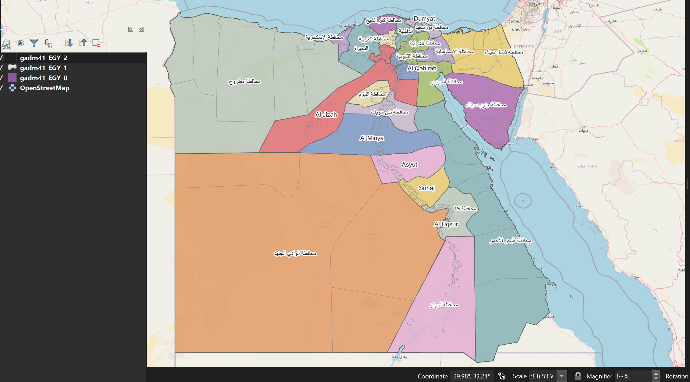
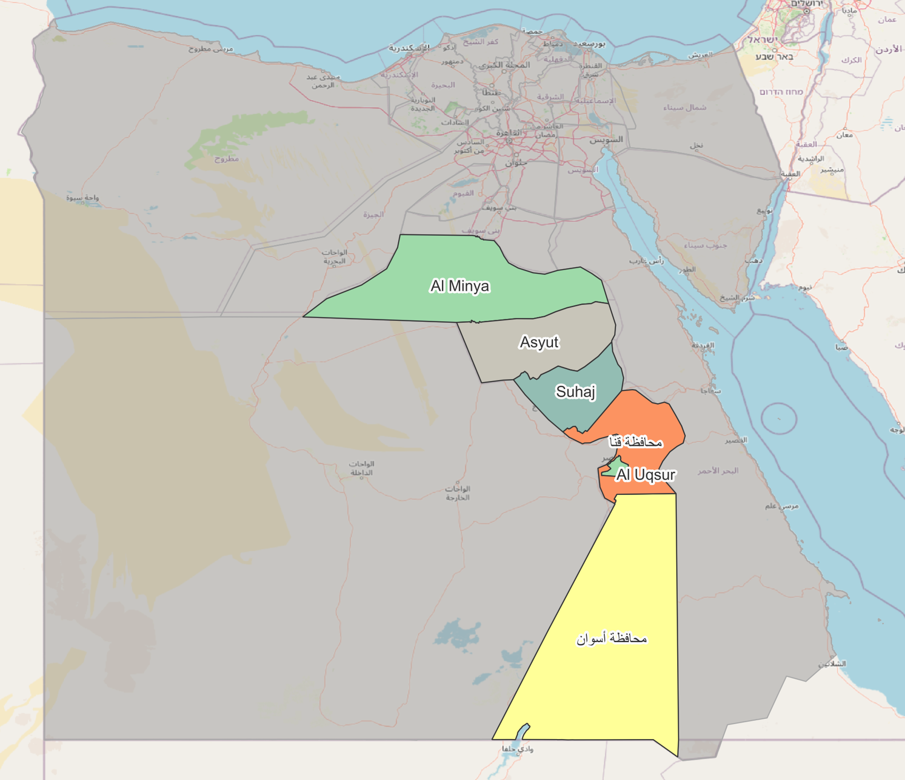
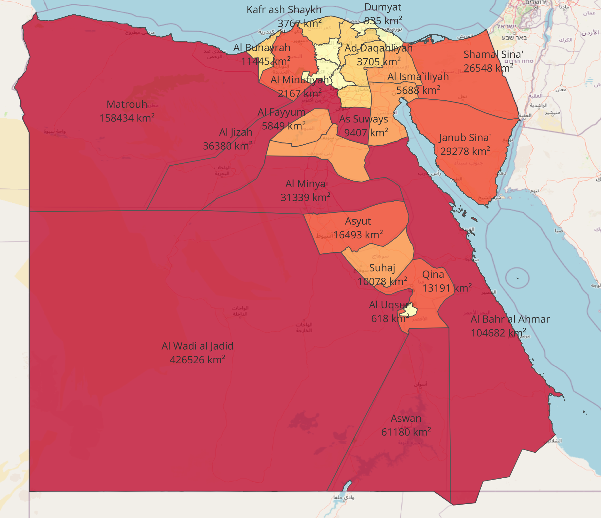

# 🗺️ GIS Portfolio — Egypt Spatial Analysis

A structured GIS learning and practice project using Egypt administrative data (GADM) to build real-world spatial analysis skills using QGIS, ArcGIS Pro, and Python.

---

## 🛠️ Tools & Technologies

| Tool | Purpose |
|------|---------|
| QGIS | Main GIS Desktop Analysis |
| ArcGIS Pro | Advanced Spatial Operations |
| Python (GeoPandas) | Automation & Analysis |
| GADM Dataset | Administrative Boundaries of Egypt |

---

## 📊 Progress Tracking & Map Output

| # | Project | Status | Skills | Map Output |
|---|---------|--------|--------|------------|
| 01 | Basemap Setup | ✅ Done | CRS, Coordinate Systems, OSM Basemap |  |
| 02 | Admin Layers | ✅ Done | Vector Layers, Symbology, Labels, CASE WHEN Expressions, Scale Visibility |  |
| 03 | Selection & Query | ✅ Done | Identify Tool, Select by Attribute, Filter |  |
| 04 | Field Calculator | ✅ Done | Calculated Fields, Expressions |  |
| 05 | Buffer Analysis | 🔄 Next | Proximity Analysis | `⏳ TBD` |
| 06 | Clip Analysis | ⏳ Upcoming | Spatial Extraction | `⏳ TBD` |
| 07 | Intersect | ⏳ Upcoming | Overlay Analysis | `⏳ TBD` |
| 08 | Print Layout | ⏳ Upcoming | Professional Map Export | `⏳ TBD` |
| 🏆 | Final — School Location | ⏳ Upcoming | Full Spatial Analysis Pipeline | `⏳ TBD` |
---

## 🎯 Final Project Goal

### 🏫 School Location Optimization (Egypt)

A spatial decision support system to identify optimal school locations based on:

- Population distribution
- Distance from existing schools
- Administrative boundaries
- Spatial overlay analysis

---

## 📌 What this project demonstrates

- Real GIS workflow (not tutorials)
- Spatial analysis skills
- Cartography & visualization
- Data processing with GIS tools
- Engineering-style project structuring